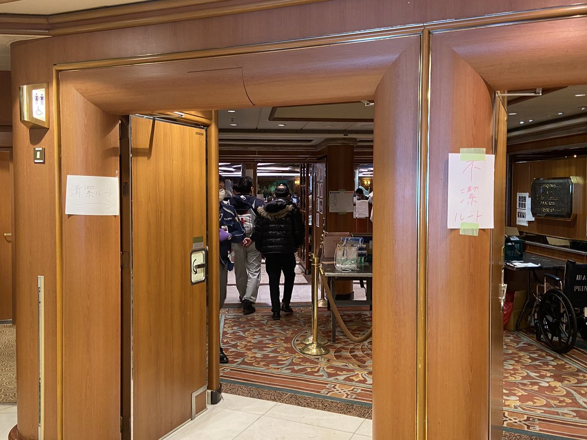

# gulp-diamond-princess-zoning

---

js ファイルを一本化しつつ、ファイル名やディレクトリを元に `(function(){ ... })()` でラップする gulp プラグインです。

1. レガシーなゾーニングによって、js パッケージの変数と関数の宣言に制約を設けます
2. モジュール毎にスコープを作ることで、変数と関数へのアクセスを高速化します、多分

## 背景

アプリケーションを構成する各モジュール間の通信には、イベントやメッセージを使って、見通し良く、再利用性の高いコーディングをすることが一般的です。しかし、これはコストとトレードオフです。

最もローコストなモジュール間通信は、グローバル変数やグローバル関数を介したものです。しかしこの手法は前出のメリットを失い、スパゲッティなコード塊となる危険と隣り合わせです。

とはいえ Web プログラミングに於いてはクライアントのマシンリソースが不明である点から、可能な限りローコストな手法を採用したいところです。

このプラグインでは、ファイル名やフォルダ名と変数と関数の宣言場所の制約によって危険を退け、コードの堅牢性の維持を狙います。

## 用語

| Name          | description |
|:--------------|:------------|
| package       | フレームワークやライブラリ集、ゲームエンジン、アプリケーションといった粒度の単位 |
| global        | パッケージの外に公開する、グローバル変数とグローバル関数 |
| packageGlobal | パッケージに所属するモジュール群で共有するグローバル変数とグローバル関数 |
| module        | パッケージに所属する、コードブロック群の単位 |
| moduleGlobal  | モジュールに所属するコード群で共有するグローバル変数とグローバル関数 |

## 例

### コード例

~~~js
gulp.task( 'precompile',
    function( cb ){
        return gulp.src( 'myUtilProject/**/*.js' )
            .pipe(
                gulpDPZ(
                    {
                        labelGlobal        : 'global',
                        labelPackageGlobal : 'packageGlobal',
                        labelModuleGlobal  : 'moduleGlobal',
                        packageGlobalArgs  : 'window,document',
                        basePath           : 'myUtilProject'
                    }
                )
            )
            .pipe(gulp.dest( 'R:/d' ));
    }
);
~~~

### プロパティ

| Name               | default value     | description |
|:-------------------|:------------------|:------------|
| labelGlobal        | `'global'`        | `Path.relative(Path.resolve(basePath),vinyl.path)` に match する文字列。Since version 0.9.8 : `"*"` を指定すると全てが global になるけどこれでは gulp-concat と変わらない。 |
| labelPackageGlobal | `'packageGlobal'` | `Path.relative(Path.resolve(basePath),vinyl.path)` に match する文字列。Since version 0.9.8 : `"*"` を指定すると global 以外は packageGlobal になる。小さいプロジェクトで、`(function(){ ... })()` のオーバーヘッドを忌避する場合に。 |
| labelModuleGlobal  | `'moduleGlobal'`  | `Path.relative(Path.resolve(basePath),vinyl.path)` に match する文字列。 |
| toEndOfScript | `'toEndOfScript'` | [スクリプトの最後に配置したいファイル](#toEndOfScript)の `Path.relative(Path.resolve(basePath),vinyl.path)` に match する文字列。 |
| packageGlobalArgs  | `''`              | packageGlobal に渡す引数。ブラウザ提供のグローバルメンバーをローカル化することでアクセスが早くなったり、圧縮時に名前が短くなる。[配列 `['window, nameSpace, emptyFunction', 'this, {}, new Function()']` も可能です。](#packageGlobalArgs_array) |
| outputFilename     | `'output.js'`     |  |
| basePath           | `''`              | 内部では `Path.resolve(basePath)` した値が使われます。[配列 `['projectA/src','projectB/src']`　も可能です。](#basePath_array) |
| wrapAll            | `false`           | [wrapAll について](#wrapAll) |

### 各ファイルの内容

~~~js
// myUtilProject/global.js
var Util = {};

// myUtilProject/packageGlobal.js
var TEMP = {};

// myUtilProject/ajaxModule/modulebGlobal.js
var ajaxCommon;

// myUtilProject/ajaxModule/XHR.js
if( window.XMLHttpRequest ){}

// myUtilProject/ajaxModule/Fetch.js
if( window.fetch ){}

// myUtilProject/toEndOfScript.js
function finalize(){}
~~~

### output

~~~js
// myUtilProject/global.js
var Util = {};

(function(window,document){
    // myUtilProject/packageGlobal.js
    var TEMP = {};

    (function(){
        // myUtilProject/ajaxModule/modulebGlobal.js
        var ajaxCommon;

        // myUtilProject/ajaxModule/XHR.js
        if( window.XMLHttpRequest ){}

        // myUtilProject/ajaxModule/Fetch.js
        if( window.fetch ){}
    })();
    // myUtilProject/toEndOfScript.js
    function finalize(){}
})(window,document);
~~~

## `wrapAll`

モジュール下の各ファイルを `(function(){})()` でラップするのは、テスト用途です。共用の変数や関数を適切に moduleGlobal に記述していない場合、例えば Clodure Compiler 等でエラーが出ます。

深すぎる `function` の入れ子は、Presto Opera で不具合に遭遇した(*1)ことがある為、避けます。

1. [Opera 9 ～ 11 で動かない問題．](https://ja.osdn.net/projects/pettanr/wiki/ItoZyun)

~~~js
// myUtilProject/global.js
var Util = {};

(function(){
    // myUtilProject/packageGlobal.js
    var TEMP = {};

    (function(){
        // myUtilProject/ajaxModule/modulebGlobal.js
        var ajaxCommon;

        (function(){
            // myUtilProject/ajaxModule/XHR.js
            if( window.XMLHttpRequest ){}
        })();
        (function(){
            // myUtilProject/ajaxModule/Fetch.js
            if( window.fetch ){}
        })();
    })();
    // myUtilProject/toEndOfScript.js
    function finalize(){}
})();
~~~

## 複数の package で `packageGlobal` を共有する(Since version 0.9.8)

異なるディレクトリで開発している package 間で、`packageGlobal` を共有できます。この為には、`basePath` に配列を与えます。

## `toEndOfScript` (Since version 0.9.9)

全てのモジュールが読み込まれてから実行したいコードの記述されたファイルのパスには `toEndOfScript` に指定した文字列を含むようにします。ファイルは `packageGlobal` の最期に出現します。

## `packageGlobalArgs` に配列を指定する (Since version 0.9.9)

配列の長さは2です。1番目の配列には packageGlobal を囲む `(funciton(){})()` の引数名。2番目の配列には `(funciton(){})()` を呼び出す値です。こちらには関数を書くことも出来ます。

指定例: `[ "window,emptyFunction,undefined", "this,new Function,void 0" ]`

出力例: `(funciton(window,emptyFunction,undefined){...})(this,new Function,void 0);`

### MyProjects/packageB/gulpfile.js

~~~js
gulp.src( [ 'D:/MyProjects/packageA/src/js/**/*.js', './src/js/**/*.js' ] )
    .pipe(
        gulpDPZ(
            {
                basePath : [ 'MyProjects/packageA/src/js/', 'MyProjects/packageB/src/js/' ]
            }
        )
    )
~~~

### output

`'packageA/src/js/'` と `'packageB/src/js/'` が同一ディレクトリに存在するように扱われます。

~~~js
// file:MyProjects/projectA/src/js/global.js
var g_Util = {};

// file:MyProjects/projectB/src/js/global.js
var g_Framework = {};

(function(window,document){
    // file:MyProjects/projectA/src/js/packageGlobal.js
    var p_projectA_TEMP = {};

    (function(){
        // file:MyProjects/projectA/src/js/domModule/moduleGlobal.js
        var m_domCommon;

        // file:MyProjects/projectA/src/js/domModule/DOM0.js
        if( document.all ){}

        // file:MyProjects/projectA/src/js/domModule/DOM1.js
        if( document.getElementsByTagName ){}
    })();

    (function(){
        // file:MyProjects/projectA/src/js/ajaxModule/moduleGlobal.js
        var m_ajaxCommon;

        // file:MyProjects/projectA/src/js/ajaxModule/XHR.js
        if( window.XMLHttpRequest ){}

        // file:MyProjects/projectA/src/js/ajaxModule/fetch.js
        if( window.fetch ){}
    })();

    // file:MyProjects/projectB/src/js/packageGlobal.js
    var p_projectB_CACHE = {};

    (function(){
        // file:MyProjects/projectB/src/js/modalWindow/moduleGlobal.js
        var m_modalWindowCommon;

        // file:MyProjects/projectB/src/js/modalWindow/manager.js
        var modalWindowManager;

        // file:MyProjects/projectB/src/js/modalWindow/modalWindowClass.js
        var ModalWindowClass;
    })();
})(window,document);
~~~